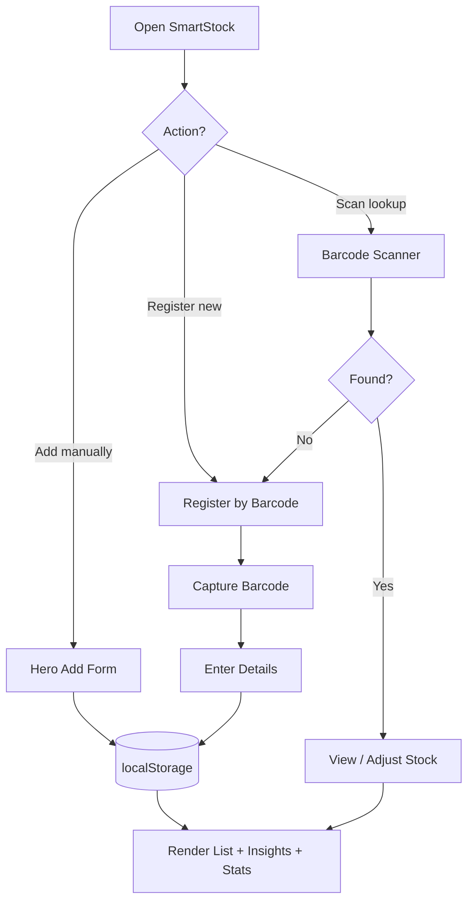

# SmartStock — Complete Product Requirements Document (PRD)

**Product Name:** SmartStock — Lagos Retail Inventory Management  
**Document Type:** Master PRD | System Specification | Development Reference  
**Version:** 2.0  
**Date:** May 22, 2026  
**Status:** Implemented (Client-Side MVP)

---

## Document Index

| Section | Description |
|---------|-------------|
| [1. Executive Summary](#1-executive-summary) | Product vision and scope |
| [2. Problem Statement](#2-problem-statement) | Retail pain points addressed |
| [3. Product Objectives](#3-product-objectives) | Goals and success criteria |
| [4. Target Users & Context](#4-target-users--context) | Who uses SmartStock and where |
| [5. Current Implementation Scope](#5-current-implementation-scope) | MVP vs. planned platform |
| [6. Application Architecture](#6-application-architecture) | Files, stack, data flow |
| [7. Page Structure & Navigation](#7-page-structure--navigation) | Layout and sections |
| [8. Design System](#8-design-system) | Colors, typography, accessibility |
| [9. Data Model](#9-data-model) | Product schema and storage |
| [10. Feature Specifications](#10-feature-specifications) | All features in detail |
| [11. Barcode System](#11-barcode-system) | Scanner, lookup, registration |
| [12. Business Rules & Validation](#12-business-rules--validation) | Logic thresholds |
| [13. DOM Element Contract](#13-dom-element-contract) | Required IDs for developers |
| [14. User Workflows](#14-user-workflows) | Step-by-step flows |
| [15. Smart Insights Engine](#15-smart-insights-engine) | Analytics logic (MVP) |
| [16. Browser & Device Requirements](#16-browser--device-requirements) | Compatibility |
| [17. Security & Privacy (Current)](#17-security--privacy-current) | Client-side limitations |
| [18. Deployment & Running](#18-deployment--running) | How to launch the app |
| [19. Sample Data & Test Barcodes](#19-sample-data--test-barcodes) | QA reference |
| [20. Known Limitations](#20-known-limitations) | MVP gaps |
| [21. Future Roadmap](#21-future-roadmap) | Alignment with platform PRD |
| [22. Related Documents](#22-related-documents) | Ecosystem PRDs |
| [23. Success Metrics](#23-success-metrics) | KPIs |
| [24. Conclusion](#24-conclusion) | Summary |

---

## 1. Executive Summary

**SmartStock** is a client-side retail inventory management web application built for supermarkets, grocery stores, and mini-marts—especially in **Lagos and Nigerian retail contexts**. It provides real-time stock visibility, smart low-stock insights, barcode-based product lookup, and barcode-first product registration—all without a backend server in the current MVP.

The application is delivered as a **single-page app** consisting of:

| File | Role |
|------|------|
| `index.html` | UI structure, styles, accessibility landmarks |
| `app.js` | Business logic, localStorage persistence, barcode APIs |

SmartStock is the **operational front-end demo** of the broader **Smart Supermarket Inventory Management & Observation System** vision documented in companion PRDs. It proves core workflows (add inventory, monitor stock, scan barcodes, register products) before a full cloud backend, POS integration, and AI forecasting layer are added.

---

## 2. Problem Statement

Retail operators in high-volume environments face:

| Problem | SmartStock MVP Response |
|---------|-------------------------|
| Manual stock tracking errors | Digital list with live updates in `localStorage` |
| No quick product lookup at shelf | Barcode scanner + instant lookup |
| Slow new product onboarding | Register-by-barcode two-step flow |
| Poor visibility into low stock | Automatic badges + insights panel |
| Lost sales from stockouts | Low-stock count and alerts (&lt;25 units) |
| No unified view of inventory value | Total stock value in insights |

---

## 3. Product Objectives

### Primary Objectives (Implemented)

1. Allow staff to **add products** with name, category, price, quantity, and optional barcode
2. Display a **live inventory list** with search and category filters
3. Provide **smart insights**: low stock count, total inventory value, fastest-moving item (by quantity)
4. Enable **barcode lookup** via camera or manual entry
5. Enable **barcode-first registration** with duplicate prevention
6. Support **quick stock adjustments** (+1/−1) from scan results
7. Persist all data **locally** across browser sessions

### Secondary Objectives (Planned — See Roadmap)

- Multi-branch sync, expiry alerts, POS integration, cloud API, role-based access
- Alignment with full supermarket platform PRD (100k+ products, offline sync, reports)

---

## 4. Target Users & Context

### Primary Users (MVP)

| Persona | Use Case |
|---------|----------|
| **Store owner / manager** | Monitor stock levels, inventory value, low-stock alerts |
| **Inventory clerk** | Add products, register items by barcode, adjust quantities |
| **Cashier (future)** | Scan items for lookup; future POS tie-in |

### Environment

- **Geography:** Nigeria (Lagos retail focus); currency displayed as **₦ (Naira)**
- **Store types:** Supermarkets, grocery stores, mini-marts, departmental shops
- **Devices:** Desktop browser, tablet, mobile (responsive layout; camera scan on supported browsers)

---

## 5. Current Implementation Scope

### In Scope (MVP — Built)

| Capability | Status |
|------------|--------|
| Add product (hero form) | ✅ |
| Live inventory list | ✅ |
| Search by name or barcode | ✅ |
| Filter by category | ✅ |
| Hero dashboard stats | ✅ |
| Smart insights panel | ✅ |
| Barcode scanner (lookup) | ✅ |
| Register product by barcode | ✅ |
| Stock adjust from scan (+1/−1) | ✅ |
| localStorage persistence | ✅ |
| Sample seed data (4 products) | ✅ |
| Responsive UI | ✅ |
| Accessibility (landmarks, ARIA, skip link) | ✅ |

### Out of Scope (MVP — Not Built)

| Capability | Notes |
|------------|-------|
| User authentication | No login |
| Cloud database / API | Client-only |
| Multi-store / multi-branch | Single store implicit |
| Expiry date tracking | In platform PRD only |
| Sales / POS integration | Future |
| Reports export (PDF/CSV) | Future |
| Edit / delete products | Not in UI (data layer supports overwrite via re-add) |
| Offline service worker | Works offline via static files + localStorage |
| Push / email alerts | Future |

---

## 6. Application Architecture

### 6.1 High-Level Architecture

```
┌─────────────────────────────────────────────────────────┐
│                     Browser (Client)                     │
│  ┌──────────────┐         ┌──────────────────────────┐  │
│  │  index.html  │────────▶│         app.js           │  │
│  │  (UI + CSS)  │         │  • State management      │  │
│  └──────────────┘         │  • Render engine         │  │
│                           │  • BarcodeDetector API   │  │
│                           │  • getUserMedia (camera) │  │
│                           └───────────┬──────────────┘  │
│                                       │                  │
│                           ┌───────────▼──────────────┐  │
│                           │  localStorage            │  │
│                           │  key: smartstock_        │  │
│                           │       inventory_v1       │  │
│                           └──────────────────────────┘  │
└─────────────────────────────────────────────────────────┘
```

### 6.2 Technology Stack (Implemented)

| Layer | Technology |
|-------|------------|
| Markup | HTML5 (semantic landmarks) |
| Styling | Embedded CSS (CSS variables, responsive grid) |
| Logic | Vanilla JavaScript (ES6+) |
| Fonts | Google Fonts: **Syne** (display), **DM Sans** (body) |
| Storage | `localStorage` (JSON serialized array) |
| Barcode | **BarcodeDetector API** (native, Chrome/Edge) |
| Camera | **MediaDevices.getUserMedia** (rear camera preferred) |

### 6.3 Initialization Flow

```
DOMContentLoaded
    └── init()
            ├── Event: #btn-primary → addProduct()
            ├── Event: #search-input, #category-filter → filterList()
            ├── initBarcodeScanner()
            ├── initBarcodeRegister()
            ├── renderList()
            ├── renderInsights()
            └── updateHeroStats()

beforeunload
    ├── stopBarcodeScanner()
    └── stopRegisterBarcodeScanner()
```

---

## 7. Page Structure & Navigation

### 7.1 Layout Hierarchy

```
<body>
  <a.skip-link>           → Skip to #main
  <header> (sticky)       → Logo + nav (not counted as section)
  <section.hero>          → Section 1: Stats + Add Product form
  <main>
    <section#barcode-scanner>   → Lookup / scan products
    <section#barcode-register>  → Register new products by barcode
    <section#inventory>          → Live list + insights panel
    <section.how-it-works>      → Process overview
  </main>
  <footer>                → Section 3: Brand + newsletter field
  <script app.js>
</body>
```

### 7.2 Navigation Links

| Link | Target | Purpose |
|------|--------|---------|
| SmartStock logo | `#` (top) | Home |
| Scanner | `#barcode-scanner` | Barcode lookup |
| Register | `#barcode-register` | Barcode registration |
| Inventory | `#inventory` | Product list |
| Insights | `#insights-panel` | Dashboard panel |
| How It Works | `#how-it-works` | Onboarding |

---

## 8. Design System

### 8.1 Color Palette (Earthy-Tech / Lagos Retail)

| Token | Hex | Usage |
|-------|-----|-------|
| Off-black | `#0f1108` | Hero, insights, register form, scanner result panels |
| Cassava-cream | `#f5f1e8` | Page background, light surfaces |
| Ankara-green | `#1d9a5f` | Primary CTA, accents, success, links |
| Ankara-dark | `#157a4c` | Hover states |
| Text muted | `#64748b` | Secondary copy |
| Border | `#e2ddd0` | Cards, list dividers |

### 8.2 Typography

| Role | Font | Weight |
|------|------|--------|
| Display / headings | Syne | 600–800 |
| Body / UI | DM Sans | 400–700 |

### 8.3 UI Patterns

| Pattern | Application |
|---------|-------------|
| Dark gradient hero | Brand entry, add-product form |
| White cards | Inventory list, scanner capture panel |
| Dark bookend panels | Insights, scan results, register form |
| Stock badges | Green (≥25), red (&lt;25) |
| Highlight state | `.highlight-scan` on list item after scan/register |

### 8.4 Accessibility

| Requirement | Implementation |
|-------------|----------------|
| Semantic landmarks | `<header>`, `<main>`, `<footer>`, `<nav>`, `<section>` |
| Skip link | First focusable element → `#main` |
| ARIA labels | Buttons, inputs, regions (`aria-live`, `role="alert"`) |
| Reduced motion | `@media (prefers-reduced-motion: reduce)` |
| Focus states | `outline` on inputs and buttons |
| Live regions | Inventory list, scan results, register alerts |

---

## 9. Data Model

### 9.1 Product Entity

| Field | Type | Required | Description |
|-------|------|----------|-------------|
| `id` | String | Yes | Unique ID (`p` + timestamp + random) |
| `name` | String | Yes | Product display name |
| `category` | String | Yes | `food`, `beverages`, `dairy`, `household` |
| `barcode` | String | No | EAN/UPC/Code128; unique if provided |
| `price` | Integer | Yes | Selling price in ₦ (must be &gt; 0) |
| `quantity` | Integer | Yes | Current stock (≥ 0) |
| `lastUpdated` | String (ISO date) | Yes | `YYYY-MM-DD` |

### 9.2 Storage

| Property | Value |
|----------|-------|
| Key | `smartstock_inventory_v1` |
| Format | JSON array of product objects |
| Seed | `INITIAL_DATA` (4 products) on first visit |
| Migration | Missing `barcode` backfilled from seed IDs |

### 9.3 Sample Seed Products

| ID | Name | Category | Barcode | Price (₦) | Qty |
|----|------|----------|---------|-----------|-----|
| p1 | Coca-Cola 50cl | beverages | 5449000000996 | 350 | 124 |
| p2 | Indomie Chicken | food | 8901234567890 | 150 | 18 |
| p3 | Peak Milk (Tin) | dairy | 5060123456789 | 1200 | 87 |
| p4 | Broom (Heavy Duty) | household | 1234567890123 | 850 | 42 |

---

## 10. Feature Specifications

### 10.1 Hero — Dashboard & Add Product

**Location:** `<section class="hero">`

#### Dashboard Stats (auto-updated)

| Stat | Calculation |
|------|-------------|
| Total Products | `inventory.length` |
| Low Stock | Count where `quantity < 25` |
| Est. Daily Sales | Sum of `price × floor(quantity × 0.1)` displayed as ₦X.Xm |

#### Add Product Form

| Field | ID | Validation |
|-------|-----|------------|
| Product Name | `#product-name` | Required, non-empty trim |
| Barcode | `#product-barcode` | Optional; must be unique if set |
| Category | `#product-category` | Required (select) |
| Quantity | `#product-qty` | Default 50; ≥ 0 |
| Price (₦) | `#product-price` | Required; &gt; 0 |
| Submit | `#btn-primary` | Triggers `addProduct()` |

**On success:** Product prepended to inventory, form cleared (qty resets to 50), list/insights/stats refresh, alert shown.

---

### 10.2 Live Inventory

**Location:** `<section id="inventory">`

| Feature | Behavior |
|---------|----------|
| Product list | `#list-root` — dynamic `<li>` per product |
| Search | `#search-input` — filters name OR barcode (case-insensitive) |
| Category filter | `#category-filter` — food, beverages, dairy, household, or all |
| Low stock badge | Red if `quantity < 25`, green otherwise |
| Barcode display | Shown in list row when present |
| Empty state | Message when no products match filter |

---

### 10.3 Smart Insights Panel

**Location:** `#insights-panel` (sticky sidebar on desktop)

| Insight | Logic |
|---------|-------|
| Low Stock Alert | Count of products with `quantity < 25` |
| Inventory Value | `Σ (price × quantity)` formatted with locale |
| Fastest Moving | Product with highest `quantity` (proxy metric in MVP) |
| LIVE badge | Static indicator (real-time re-render on data change) |

---

### 10.4 How It Works

**Location:** `#how-it-works`

Three step cards explaining: Register by Barcode → Monitor Stock → Act on Alerts.

---

### 10.5 Footer

**Location:** `<footer>`

- Brand: SmartStock
- Email field: `#input-footer-email` (UI only; no handler in MVP)
- Copyright notice

---

## 11. Barcode System

### 11.1 Supported Barcode Formats

Via `BarcodeDetector`:

`ean_13`, `ean_8`, `upc_a`, `upc_e`, `code_128`, `code_39`, `qr_code`

### 11.2 Barcode Normalization

```javascript
normalizeBarcode(code) → trim whitespace, remove internal spaces
```

### 11.3 Module A — Barcode Scanner (Lookup)

**Section ID:** `#barcode-scanner`

| Action | Trigger | Result |
|--------|---------|--------|
| Start Scan | `#btn-start-scan` | Opens camera, polls detector every 400ms |
| Stop Scan | `#btn-stop-scan` | Releases camera stream |
| Manual Lookup | `#btn-lookup-barcode` + `#barcode-manual-input` | `handleBarcodeLookup()` |
| Scan detected | Auto | Debounced 2.5s per same code → lookup |

#### Lookup Results (`#barcode-result-content`)

**Product found:**
- Shows name, barcode, category, price, stock (color-coded)
- Actions: `−1 Stock`, `+1 Stock`, `View in List`
- Highlights item in inventory list

**Product not found:**
- Shows barcode + **Register by Barcode** button
- Auto-navigates to register section with barcode pre-filled

---

### 11.4 Module B — Register Product by Barcode

**Section ID:** `#barcode-register`

#### Two-Step Flow

```
Step 1: Capture Barcode
    ├── Camera: #btn-register-scan-start / #register-barcode-video
    ├── Manual: #register-barcode-input + #btn-use-barcode
    └── Validates: non-empty, not already registered

Step 2: Product Details (unlocks after valid barcode)
    ├── #reg-barcode-locked (read-only)
    ├── #reg-product-name (required)
    ├── #reg-product-category
    ├── #reg-product-qty (default 50)
    ├── #reg-product-price (required, > 0)
    └── #btn-register-barcode → registerProductByBarcode()
```

#### Register Alerts (`#register-alert`)

| Class | Meaning |
|-------|---------|
| `.success` | Barcode captured / product registered |
| `.warning` | Duplicate barcode |
| `.error` | Validation failure |

#### On Successful Registration

1. Product saved to `localStorage`
2. Form reset, register section disabled
3. List, insights, hero stats updated
4. New item highlighted in inventory
5. Auto-scroll to inventory section

---

### 11.5 Cross-Module Integration

| From | To | Behavior |
|------|-----|----------|
| Scanner (not found) | Register section | `prefillAddFormFromBarcode()` |
| Scanner (+1/−1) | Same product | Re-runs lookup to refresh result panel |
| Register | Inventory | Scroll + highlight new item |

---

## 12. Business Rules & Validation

| Rule | Value / Logic |
|------|---------------|
| Low stock threshold | `quantity < 25` |
| Price validation | Must be integer &gt; 0 |
| Quantity validation | Must be ≥ 0 |
| Product name | Required on add/register |
| Barcode uniqueness | No two products with same normalized barcode |
| Stock floor | Cannot go below 0 on adjustment |
| Scan debounce | Same barcode ignored within 2.5 seconds |
| Duplicate register block | Lookup existing before enabling Step 2 form |
| HTML escaping | Product names/barcode escaped in `renderList()` via `escapeHtml()` |

---

## 13. DOM Element Contract

### 13.1 Required IDs (PRD + Implementation)

| ID | Element | Module |
|----|---------|--------|
| `#btn-primary` | Add product button | Hero |
| `#list-root` | Inventory `<ul>` | Inventory |
| `#insights-panel` | Insights container | Inventory |
| `#product-name` | Name input | Hero |
| `#product-barcode` | Barcode input | Hero |
| `#product-category` | Category select | Hero |
| `#product-qty` | Quantity input | Hero |
| `#product-price` | Price input | Hero |
| `#search-input` | Search field | Inventory |
| `#category-filter` | Category filter | Inventory |
| `#barcode-video` | Scanner camera | Scanner |
| `#btn-start-scan` | Start lookup scan | Scanner |
| `#btn-stop-scan` | Stop lookup scan | Scanner |
| `#barcode-manual-input` | Manual barcode | Scanner |
| `#btn-lookup-barcode` | Lookup button | Scanner |
| `#barcode-result-content` | Scan result area | Scanner |
| `#register-barcode-video` | Register camera | Register |
| `#btn-register-scan-start` | Start register scan | Register |
| `#btn-register-scan-stop` | Stop register scan | Register |
| `#register-barcode-input` | Manual register barcode | Register |
| `#btn-use-barcode` | Confirm barcode | Register |
| `#register-barcode-display` | Captured barcode display | Register |
| `#register-form-panel` | Step 2 form container | Register |
| `#reg-barcode-locked` | Locked barcode field | Register |
| `#reg-product-name` | Register name | Register |
| `#reg-product-category` | Register category | Register |
| `#reg-product-qty` | Register quantity | Register |
| `#reg-product-price` | Register price | Register |
| `#btn-register-barcode` | Submit registration | Register |
| `#register-alert` | Alert messages | Register |
| `#input-footer-email` | Footer email (PRD) | Footer |

### 13.2 Hidden PRD Placeholder IDs (Hero)

`#input-email`, `#input-store`, `#input-category`, `#input-sku`, `#input-threshold`, `#input-date-range` — present for future platform integration.

---

## 14. User Workflows

### 14.1 Add Product (Manual)

```
Open app → Hero form
    → Enter name, optional barcode, category, qty, price
    → Click "+ Add to Inventory"
    → Product appears top of list
    → Stats and insights update
```

### 14.2 Look Up Product by Barcode

```
Nav → Scanner
    → Start Scan OR enter barcode manually → Look Up
    → IF found: view details, adjust stock, or view in list
    → IF not found: click "Register by Barcode" OR auto-redirect to register
```

### 14.3 Register New Product by Barcode

```
Nav → Register
    → Step 1: Scan or type barcode → "Use This Barcode"
    → IF duplicate: warning, form stays locked
    → IF new: Step 2 unlocks
    → Enter name, category, opening stock, price
    → "Register Product"
    → Success alert → inventory scroll + highlight
```

### 14.4 Monitor & Filter Inventory

```
Nav → Inventory
    → Type in search (name or barcode)
    → OR select category filter
    → View low-stock red badges
    → Read insights panel (right)
```

### 14.5 Workflow Diagram



---

## 15. Smart Insights Engine

### 15.1 MVP Logic (Implemented)

| Metric | Formula / Rule |
|--------|----------------|
| Low stock count | `items.filter(qty < 25).length` |
| Total inventory value | `Σ (price × quantity)` |
| Fastest moving | `max(quantity)` — simplified proxy |
| Hero daily sales est. | `Σ (price × floor(qty × 0.1))` |

### 15.2 Planned Intelligence (Platform PRD)

| Feature | Target |
|---------|--------|
| Expiry alerts | 90/60/30/7 days before expiry |
| Restock alert | Stock &lt; 30% capacity |
| Fast-seller detection | Sales velocity, not just quantity |
| Discount engine | Slow movers + near-expiry |
| Demand forecast | `α×Recent + β×Seasonal + γ×Trend` |

---

## 16. Browser & Device Requirements

| Capability | Chrome / Edge | Firefox | Safari | Mobile |
|------------|---------------|---------|--------|--------|
| Core app (forms, list) | ✅ | ✅ | ✅ | ✅ |
| localStorage | ✅ | ✅ | ✅ | ✅ |
| Camera scan | ✅ | ❌* | Limited | ✅ (Chrome Android) |
| Manual barcode | ✅ | ✅ | ✅ | ✅ |

\*Firefox: use manual barcode entry; `BarcodeDetector` not available.

### Camera Permissions

- Requires HTTPS or `localhost` for `getUserMedia`
- Rear camera preferred: `facingMode: 'environment'`
- User denial shows alert with manual fallback message

---

## 17. Security & Privacy (Current)

| Topic | MVP Status |
|-------|------------|
| Authentication | None — open local app |
| Data location | Browser `localStorage` only |
| Encryption | Not implemented |
| XSS mitigation | `escapeHtml()` on rendered names/barcodes |
| API calls | None |
| PII | Footer email field not submitted |

**Production requirements (future):** JWT auth, RBAC, encrypted transit (TLS), audit trail, secure cloud backup per platform PRD.

---

## 18. Deployment & Running

### 18.1 File Structure

```
INVENTORY MGT PROJECT/
├── index.html          # Frontend UI
├── app.js              # Application logic
├── PRD-SmartStock-Complete.md   # This document
├── PRD-Smart-Supermarket-Inventory-Management.md
├── PRD-IoT-Object-Verification-System.md
└── PRD-Landing-Page-UI.md
```

### 18.2 Run Locally

**Option A — Local HTTP server (recommended for camera):**

```bash
# From project folder (Node example)
npx serve -l 8080
# Open http://localhost:8080
```

**Option B — Open file directly:**

```
file:///e:/INVENTORY MGT PROJECT/index.html
```

Camera may be restricted on `file://`; use localhost for barcode scanning.

### 18.3 Clear / Reset Data

```javascript
// In browser DevTools console:
localStorage.removeItem('smartstock_inventory_v1');
location.reload();
```

---

## 19. Sample Data & Test Barcodes

### 19.1 QA Test Barcodes (Seed Data)

| Barcode | Expected Product |
|---------|------------------|
| `5449000000996` | Coca-Cola 50cl |
| `8901234567890` | Indomie Chicken (low stock: 18) |
| `5060123456789` | Peak Milk (Tin) |
| `1234567890123` | Broom (Heavy Duty) |

### 19.2 Register New Product Test

Use unused barcode e.g. `9876543210987` → complete Step 2 → verify appears in list with barcode.

### 19.3 Duplicate Test

Scan `5449000000996` in Register → expect warning: already registered.

---

## 20. Known Limitations

| Limitation | Impact | Mitigation |
|------------|--------|------------|
| No backend | Data not shared across devices | Future API |
| No edit/delete UI | Cannot fix typos in-app | Clear localStorage or future CRUD |
| localStorage cap | ~5MB browser limit | Cloud DB for scale |
| BarcodeDetector browser support | No camera scan in Firefox | Manual entry |
| "Fastest moving" = highest qty | Not true sales velocity | Integrate POS sales data |
| Simulated daily sales | Hero stat is estimate only | Real sales module |
| No auth | Anyone with file access sees data | Add login |
| Alert uses `window.alert()` | Basic UX | Toast / inline notifications |
| Single currency | ₦ only | Multi-currency in platform PRD |
| No expiry / batch fields | Food safety not tracked | Platform PRD features |

---

## 21. Future Roadmap

### Phase 1 — Backend Foundation
- REST API (`/api/products`, `/api/inventory`, `/api/alerts`)
- PostgreSQL / MongoDB
- User auth (JWT) + roles (Admin, Manager, Cashier, Warehouse)

### Phase 2 — Retail Intelligence
- Expiry monitoring (90/60/30/7 day alerts)
- Restocking at 30% threshold
- Fast/slow seller detection from sales data
- Discount recommendation engine
- Real-time reports

### Phase 3 — Integrations
- POS sync (I-Class and others)
- IoT loss prevention (IOVS sensor fusion — see IOVS PRD)
- Mobile app (React Native / Flutter)
- Offline sync when connectivity returns

### Phase 4 — Scale & AI
- 100,000+ products
- Demand forecasting
- Multi-branch, multi-currency
- AI chatbot assistant
- E-commerce integration

---

## 22. Related Documents

| Document | Relationship |
|----------|--------------|
| `PRD-Smart-Supermarket-Inventory-Management.md` | Full enterprise platform vision (expiry, restocking, AI, API, roles) |
| `PRD-IoT-Object-Verification-System.md` | Loss prevention / CCTV + RFID + POS fusion (future integration) |
| `PRD-Landing-Page-UI.md` | Original UI structure spec (IDs, design tokens) |
| `PRD-SmartStock-Complete.md` | **This document** — authoritative spec for built SmartStock MVP |

---

## 23. Success Metrics

### MVP Demo Metrics

| Metric | Target |
|--------|--------|
| Add product time | &lt; 30 seconds |
| Barcode lookup time | &lt; 3 seconds (manual); &lt; 5 seconds (scan) |
| Register by barcode flow | Completable in 2 steps without errors |
| UI load | Instant (static assets) |
| Data persistence | Survives page refresh |

### Platform Metrics (Future — from Supermarket PRD)

| Metric | Target |
|--------|--------|
| Reduce expired products | 70% |
| Stock accuracy | 95% |
| Reduce stockouts | 60% |
| Revenue increase | 25% |
| Waste reduction | Significant |

---

## 24. Conclusion

**SmartStock** is a fully functional client-side MVP that demonstrates modern supermarket inventory workflows for Lagos retail: add and track products, monitor low stock and inventory value, scan barcodes for instant lookup, and register new items through a dedicated barcode-first flow.

The application ships as **`index.html` + `app.js`**, persists data in **`localStorage`**, and requires no server for core operations. Camera barcode scanning enhances speed on supported browsers; manual entry ensures universal access.

This PRD is the **single source of truth** for everything built in SmartStock today, and maps forward to the enterprise **Smart Supermarket Inventory Management & Observation System** and **IOVS** security layer documented in companion PRDs.

---

## Appendix A — JavaScript Function Reference

| Function | Purpose |
|----------|---------|
| `loadData()` | Load/migrate inventory from localStorage |
| `saveData(data)` | Persist inventory array |
| `generateId()` | Create unique product ID |
| `addProduct()` | Hero form submission |
| `renderList(filtered?)` | Render `#list-root` |
| `renderInsights()` | Render `#insights-panel` |
| `updateHeroStats()` | Update stat cards |
| `filterList()` | Search + category filter |
| `normalizeBarcode(code)` | Sanitize barcode string |
| `findProductByBarcode(code)` | Lookup product |
| `handleBarcodeLookup(code)` | Scanner lookup flow |
| `startBarcodeScanner()` / `stopBarcodeScanner()` | Lookup camera |
| `adjustProductStock(id, delta)` | ±1 stock from scan result |
| `handleRegisterBarcodeCapture(code)` | Validate barcode for registration |
| `registerProductByBarcode()` | Complete registration |
| `startRegisterBarcodeScanner()` / `stopRegisterBarcodeScanner()` | Register camera |
| `init()` | App bootstrap |

---

## Appendix B — Category Enumeration

| Value | Display |
|-------|---------|
| `food` | Food |
| `beverages` | Beverages |
| `dairy` | Dairy |
| `household` | Household |

---

*End of Document — SmartStock Complete PRD v2.0*
